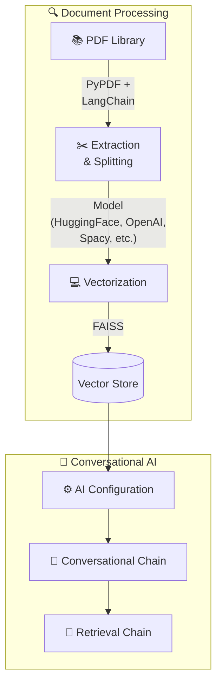

```mermaid
flowchart TD

subgraph "🔍 Document Processing"
    A["📚 PDF Library"] 
    A -- "PyPDF +</br>LangChain" --> B["✂️ Extraction </br>& Splitting"]
    B -- "Model</br>(HuggingFace, OpenAI,</br>Spacy, etc.)" --> C["💻 Vectorization"]
    C -- "FAISS" --> D[("Vector Store")]
end

subgraph "🤖 Conversational AI"
    D --> E["⚙️ AI Configuration"]
    E --> F["🔗 Conversational Chain"]
    F --> G["🔭 Retrieval Chain"]
end
```
